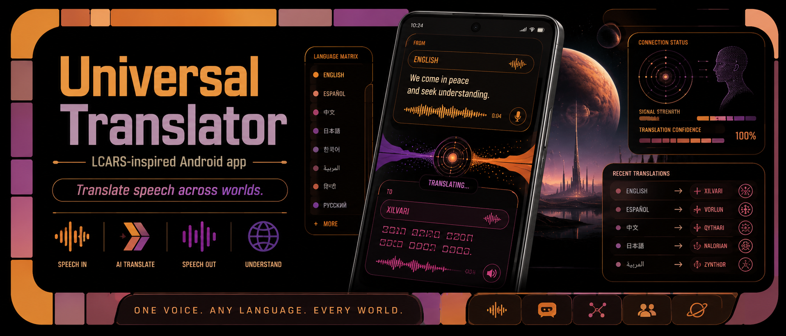
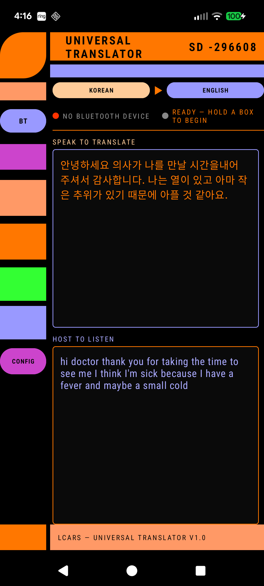

  

# LCARS Universal Translator

An Android app that performs real-time bidirectional speech translation with a Star Trek LCARS-themed interface.

  

## Features

- Push-to-talk speech recognition and translation in both directions
- On-device translation via Google ML Kit (offline, ~30 MB per language pair)
- Optional Google Cloud Translation API for higher quality results
- Bluetooth headset support (SCO audio routing) with phone mic fallback
- Text-to-speech playback of translated output
- Configurable speech recognition model, silence timeout, TTS rate/pitch
- Foreground service to keep the translator alive while the screen is off
- Stardate display

## Requirements

- Android 7.0+ (API 24)
- Microphone

## Tech

- Kotlin, Android SDK 36
- Google ML Kit (language identification, on-device translate)
- Android SpeechRecognizer
- Android TextToSpeech
- Bluetooth SCO audio
